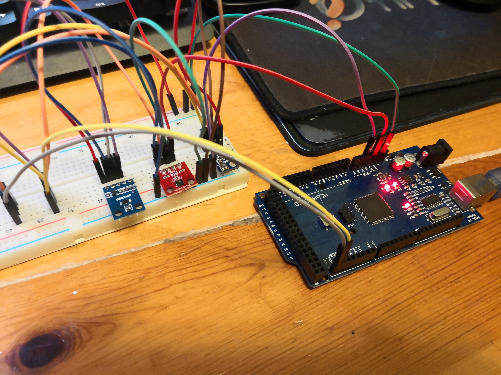
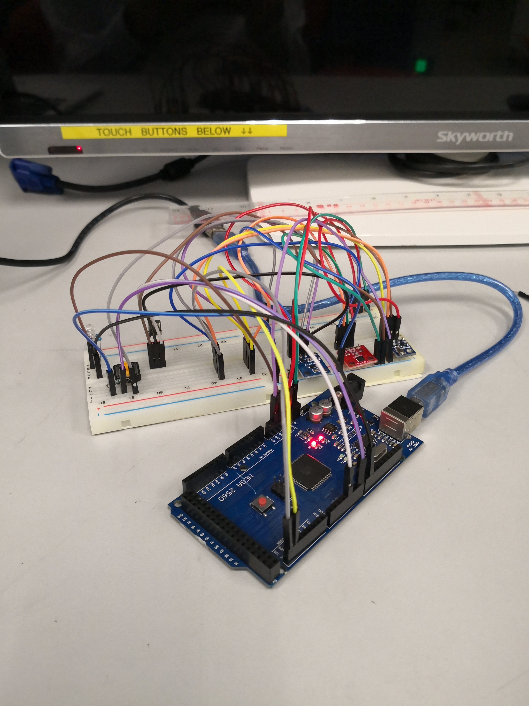

# AC Remote Device

## About
This is a device used to monitor the temperature, humidity, pressure and light intensity from the daylight inside a indoor environment, and also perform certain action to control the air conditioner. It helps to analyse the indoor environment properties which the target user is staying. The data this device collected will be sent to the online server, and by combining this data and other data collected from other devices, a group of environment properties will be sent to the reinforcement learning agent. The reinforcement learning agent will send a control signal according to the update rate. And this device will receive the control signal and perform the action.

## Electronic Part
### Device Schematics
[Link to diagram, created by Draw.io](https://www.draw.io/#Aeddylau328%2Ffyp-artificial-intelligence-ac-control-device%2Fmaster%2FAC%20Remote%20Device%2FAC_Remote_Device_Electronic_Diagram)

### Development Process
#### Reading Environment Status
To collect the temperature, humidity, pressure and light intensity, this device used three integrated modules, which are BMP180, BH1750 and HTU21D. For BMP180, it collects the barometric pressure. For BH1750, it collects the light intensity from the sun. For HTU21D, it collects the indoor temperature and humidity. By using the corresponding arduino libraries, the device can receive the signals generate by differenet sensors and output the correct value.

Below is the connection betweeen the three integrated modules and Arudino Mega 2560.

Below is the test of reading the indoor environment.

#### IR Communication
To control the air conditioner, this device used an infrared transmitter and an infrared receiver to send and receive signals. The infrared receiver, VS1838B, is specified for the frequency of 38kHz, which is a typical frequency for home appliances. The usage of the infrared receiver is to record the signals of the air conditioner remote, by recording the temperature settings signals, this device can replace the original remote, as an IR LED which is the infrared transmitter is added to this device. It is able for this device to record the infrared signals and send the recorded signals.

Below is the connection between the infrared module and the Arduino Mega 2560.

Below is the test of sending infrared signals to a television. The infrared signal from the television remote is recorded before the test by the infrared receiver.

#### Online Database Communication
To record and process the data, this device will send and save the environment data to the online database. As Arduino Mega 2560 does not provide network connection, NodeMCU is used as a module for networking. The Arduino Mega 2560 will transfer the data to the NodeMCU, and the NodeMCU will send the data as a json type file to the online database directly. For the online database, this project used the Google Firebase as a online server. The online server provided a online real-time database for saving the data which is commonly used as an IoT database.

Below is the test of sending the data to Google Firebase.
