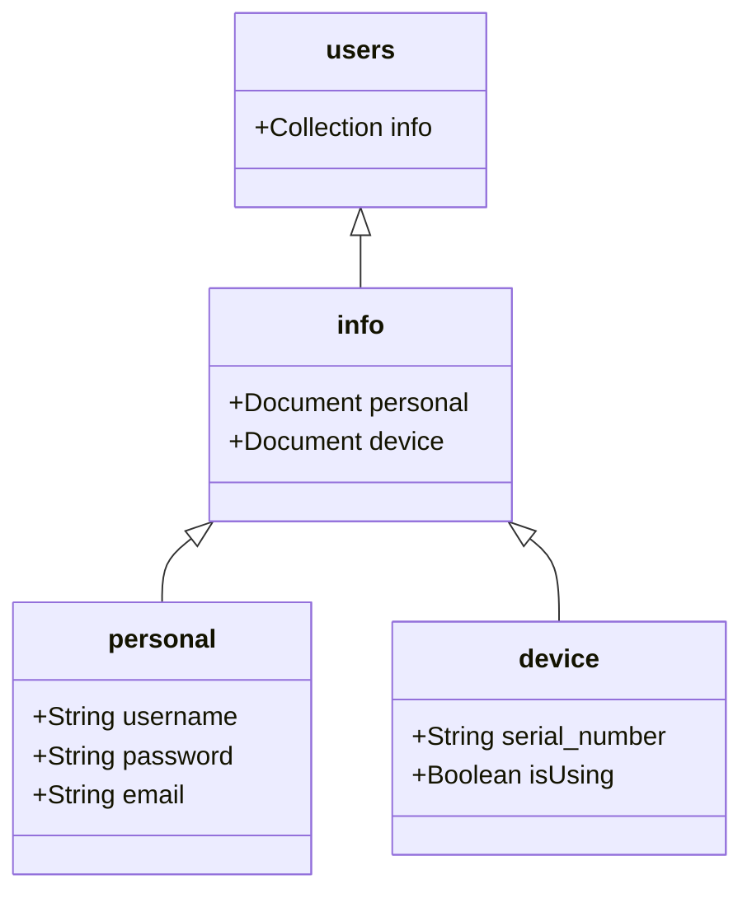

# AC Monitor App

## Introduction
In order to let the user to access the data about the indoor environment and the power consumption of the air conditioner, the mobile app "AC Monitor App" is created to ease the problem. The mobile app can show the instant data of the indoor environment, and let the user to response to the device, which is giving feedback to the AC remote device.

Besides, by using the firebase to save the data, the mobile app can display the current state of the indoor environment, so the user can instantly know the environment temperature, humidity and light intensity. Also, this mobile app can display the control action of the agent, which the user can see how the agent help you control the air conditioner.

## Firestore Design
