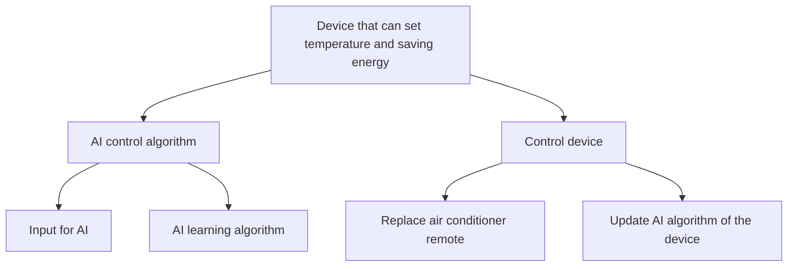
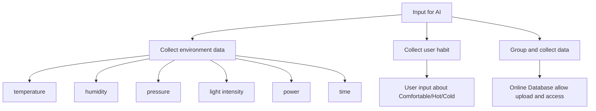
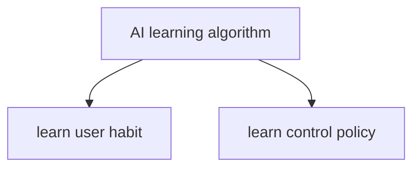
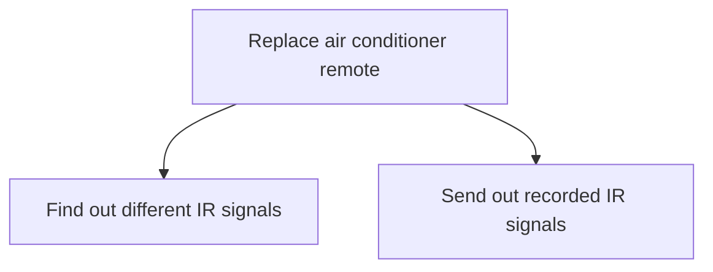
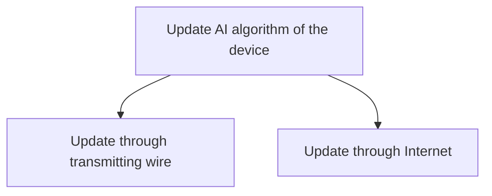

# FYP Artificial Intelligence AC Control Device

### This is my undergraduate final year project at The Chinese University of Hong Kong. Building a functional artificial intelligence air conditioner control device to help the user to monitor the air conditioner.

## Background
### Motivation
Over the last decades, lots of technologies and products developed and created to help improve our quality of life. From the discovery of the smartphone to the invention of the self-driving car, human has been using the knowledge to make life more convenient. Smart appliances are a world trend that aims to create a comfortable environment, while users mostly do not need to pay effort to it, such as vacuum cleaner robot. Besides, due to the importance of environmental protection and the seriousness of the energy crisis, energy-efficient appliances are also a crucial target for smart appliances. However, smart appliances are usually expensive and required to replace the original appliances, such as fan, heater, washer and air conditioner. Someone may not be able to replace those appliances instantly with different reasons. As a result, I would like to create a device as a medium to help the appliances to become smart and energy-efficient. Hence, I focus on building an artificial intelligence control device to manage the air conditioner. The ultimate goal for this device is to set the temperature that suitable for the user, while the air conditioner consumes less power as possible.

### Why target Air Conditioner / Heater?
Since Hong Kong belongs to the subtropical climate, its temperature and humidity are considered as high throughout the year in comparing other places. The hot and humid environment in Hong Kong causes the residents to feel discomfort in Summer, as it is much more difficult to evaporate the sweat and dissipate the body heat. As a result, the demand for cooling is high in Hong Kong. According to the Hong Kong Energy End-use Data 2019 from the Electrical and Mechanical Services Department (EMSD), the electricity consumption of air conditioning in the residential part and in the commercial part occupied 38% and 30% in 2017, both of them own the highest proportion among others. This implies that air conditioning is one of the most important aspects of electricity consumption in Hong Kong.

## Problem Description
### Main Problems

### Sub Problems of AI control algorithm

### Sub Problems of AI control algorithm

### Sub Problems of Control device

### Sub Problems of Control device
