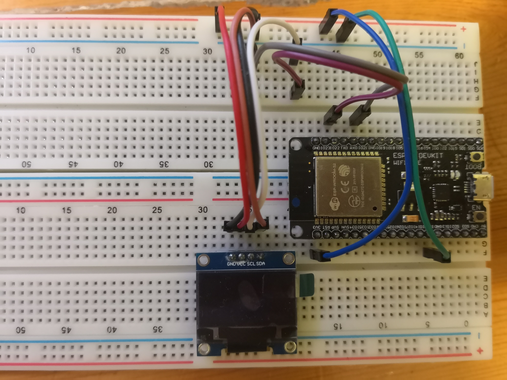

# Smartwatch Device

## About
This device is used to monitor the user's heart rate and body temperature, and it also acts as a feedback signal from user which is whether the user is feeling comfortable or not. The data collected by this device will be sent to the online server, and the data will be grouped to other data and send to the reinforcement learning agent. The learning agent will then determine which action is the best for the user and to minimize the energy consumption.

## Electronic Part
### Device Schematics
[Link to diagram, created by Draw.io](https://www.draw.io/#Aeddylau328%2Ffyp-artificial-intelligence-ac-control-device%2Fmaster%2FSmartwatch%20Device%2FSmartwatch_Electronic_Diagram)

### Development Process
#### OLED Display
To show the heart beat per minute (BPM) and the body temperature to the user, this device used an organic LED monitor (OLED monitor). The monitor size is 128x64 pixels or 0.96 inch.

Below show the connection between OLED monitor and the ESP32 module.
