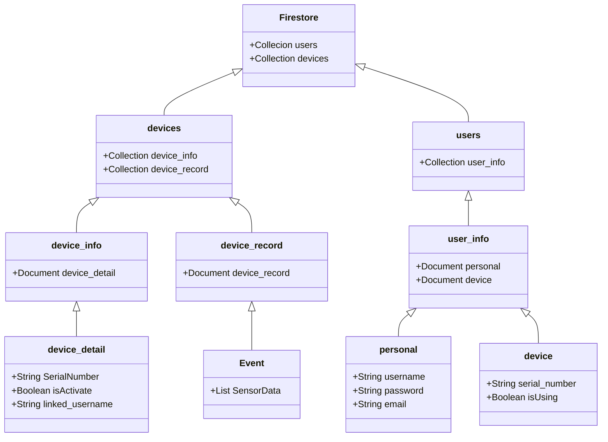

# Firebase

## Firebase Firestore

```mermaid
classDiagram

    class Firestore{
        +Collecion users
        +Collection devices
    }
    Firestore <|-- devices
    Firestore <|-- users

    devices <|-- device_info
    devices: +Collection device_info
    devices: +Collection device_record
    class device_info{
        +Document device_detail
    }
    
    devices <|-- device_record
    class device_record{
        +Document device_record
    }
    
    device_record <|-- Event
    class Event{
        +List SensorData
    }
    
    device_info<|--device_detail
    class device_detail{
        +String SerialNumber
        +Boolean isActivate
        +String linked_username
    }
    
    users <|-- user_info
    users: +Collection user_info
    class user_info{
        +Document personal
        +Document device
    }
    user_info <|--personal
    user_info <|--device
    class personal{
        +String username
        +String password
        +String email
    }
    class device{
        +String serial_number
        +Boolean isUsing
    }
```