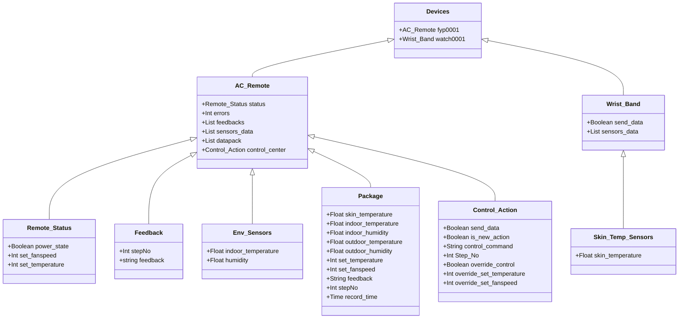
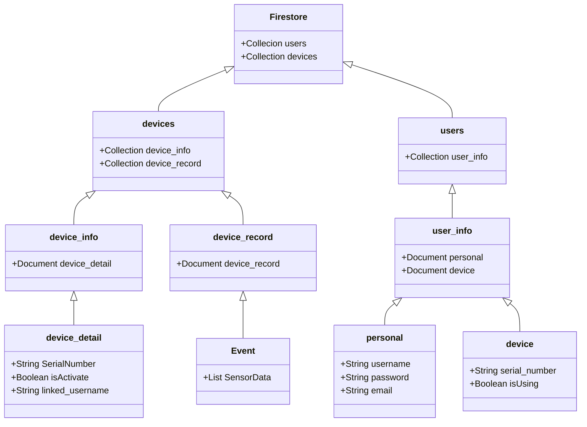

# Firebase

## Firebase Realtime Database

```mermaid
classDiagram

    class Devices{
        +AC_Remote fyp0001
        +Wrist_Band watch0001
    }
    Devices <|-- AC_Remote
    Devices <|-- Wrist_Band
    
    class AC_Remote{
        +Remote_Status status
        +Int errors
        +List<Feedback> feedbacks
        +List<Env_Sensors> sensors_data
        +List<Package> datapack
        +Control_Action control_center
    }
    
    AC_Remote <|-- Remote_Status
    AC_Remote <|-- Feedback
    AC_Remote <|-- Env_Sensors
    AC_Remote <|-- Package
    AC_Remote <|-- Control_Action
    
    class Remote_Status{
        +Boolean power_state
        +Int set_fanspeed
        +Int set_temperature
    }
    
    class Feedback{
        +Int stepNo
        +string feedback
    }
    
    class Env_Sensors{
        +Float indoor_temperature
        +Float humidity
    }

    class Package{
        +Float skin_temperature
        +Float indoor_temperature
        +Float indoor_humidity
        +Float outdoor_temperature
        +Float outdoor_humidity
        +Int set_temperature
        +Int set_fanspeed
        +String feedback
        +Int stepNo
        +Time record_time
    }
    
    class Control_Action{
        +Boolean send_data
        +Boolean is_new_action
        +String control_command
        +Int Step_No
        +Boolean override_control
        +Int override_set_temperature
        +Int override_set_fanspeed
    }
    
    class Wrist_Band{
        +Boolean send_data
        +List<Skin_Temp_Sensors> sensors_data
    }
    
    Wrist_Band <|-- Skin_Temp_Sensors
    
    class Skin_Temp_Sensors{
        +Float skin_temperature
    }
    
```

## Firebase Firestore

```mermaid
classDiagram

    class Firestore{
        +Collecion users
        +Collection devices
    }
    Firestore <|-- devices
    Firestore <|-- users

    devices <|-- device_info
    devices: +Collection device_info
    devices: +Collection device_record
    class device_info{
        +Document device_detail
    }
    
    devices <|-- device_record
    class device_record{
        +Document device_record
    }
    
    device_record <|-- Event
    class Event{
        +List SensorData
    }
    
    device_info<|--device_detail
    class device_detail{
        +String SerialNumber
        +Boolean isActivate
        +String linked_username
    }
    
    users <|-- user_info
    users: +Collection user_info
    class user_info{
        +Document personal
        +Document device
    }
    user_info <|--personal
    user_info <|--device
    class personal{
        +String username
        +String password
        +String email
    }
    class device{
        +String serial_number
        +Boolean isUsing
    }
```